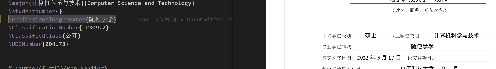

# UESTC-Thesis-Latex-Template
UESTC Thesis Latex Template

使用方式参考广为流传版本 https://github.com/tinoryj/ThesisUESTC
适配了2022年新标准的参考文献格式

## 使用说明

### 设置分类号、密级、UDC号

* UDC编号查询：https://udcsummary.info/php/index.php?lang=chi&pr=Y
* 分类号查询：http://pss.uestc.edu.cn:8080/chineseSearch.action

将以下参数设置在正文开始前（与学号等设置类似）
```tex
\ClassificationNumber{TP309.2}
\ClassifiedClass{公开}
\UDCNumber{004.78}
... 
\begin{document}
```

### 专硕设置专业学位领域

```tex
\ProfessionalDegreeArea{随便学学}
```

### 使用代码模板

如下所示，使用代码环境。其中style用于指定语言进行代码高亮；caption用于设置代码段标题；label用于生成代码段标签，以便在正文中引用。这里三项参数均为非必填项（但不填style会导致没有任何格式和高亮）。

```tex
\begin{lstlisting}[style=shell, caption={xxxx},label{xxxx}]
sudo apt install xxx
\end{lstlisting}
```

### 不显示作者姓名

由于目前将author设置为空会导致error，可采用以下方法进行设置（即设置为空格）

```tex
\author{$\quad$}{$\quad$}
```

## 更新日志
* 2022.3.17：新版cls模板提供了分类号、密级、UDC号的设置功能，使用方法如下所示(在main.tex中\begin{document}之前加入，与作者等信息等同)：
  
  * UDC编号查询：https://udcsummary.info/php/index.php?lang=chi&pr=Y
* 2022.3.17：修正英文封面中学号和姓名顺序错误的问题（对调）
* 2022.3.17：修正“答辩委员会主席”后下划线长度不足的问题
* 2022.3.18：增加专业硕士专用封面：
  * 新增\ProfessionalDegreeArea{}用于设置“专业学位领域”，如下所示：
  
* 2022.3.18：修正页眉下划线宽度为0.75磅，修正专硕英文封面学号和姓名顺序