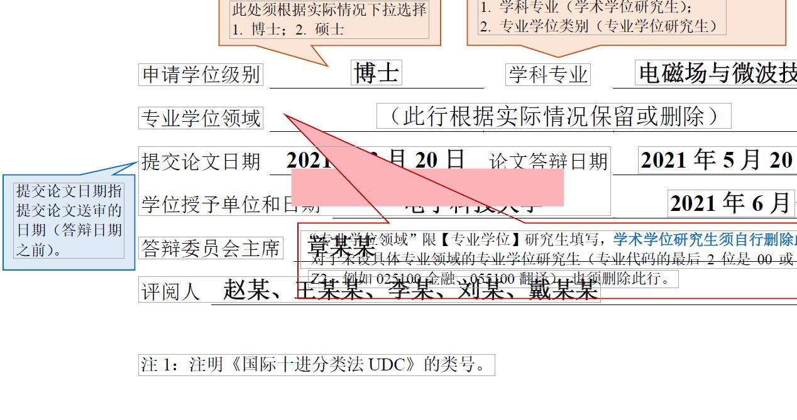
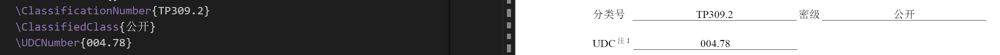

# UESTC-Thesis-Latex-Template

## Table of contents

- [UESTC-Thesis-Latex-Template](#uestc-thesis-latex-template)
  - [Table of contents](#table-of-contents)
  - [Instructions for use](#instructions-for-use)
    - [Set paper related information](#set-paper-related-information)
      - [Degree information settings (select the corresponding template)](#degree-information-settings-select-the-corresponding-template)
      - [Author, tutor, topic, and other basic information](#author-tutor-topic-and-other-basic-information)
      - [Set up professional degree fields (specialized for professional masters/doctors)](#set-up-professional-degree-fields-specialized-for-professional-mastersdoctors)
      - [Chairman of the Defense Committee](#chairman-of-the-defense-committee)
      - [Set up co-tutors](#set-up-co-tutors)
        - [Professional Degree Master/Ph.D. (Please follow the steps below)](#professional-degree-masterphd-please-follow-the-steps-below)
        - [Academic Degree Master/PhD (please follow the steps below)](#academic-degree-masterphd-please-follow-the-steps-below)
      - [Classification number, classification, UDC number](#classification-number-classification-udc-number)
    - [Diagram and table directory settings](#diagram-and-table-directory-settings)
    - [acronym/symbol table directory settings](#acronymsymbol-table-directory-settings)
    - [Using code templates](#using-code-templates)
    - [(for blind review submission) does not display the author's name](#for-blind-review-submission-does-not-display-the-authors-name)
    - [Hanging indent issue when the number of references exceeds 100](#hanging-indent-issue-when-the-number-of-references-exceeds-100)
    - [Prohibit English word truncation and newline](#prohibit-english-word-truncation-and-newline)
    - [Numbers/Roman characters in bold](#numbersroman-characters-in-bold)
    - [overleaf remarks](#overleaf-remarks)
  - [Beamer Slides Template](#beamer-slides-template)
  - [Changelog](#changelog)

## Instructions for use

Refer to the various instructions on the use of this template in main.tex, and the text can be referred to [a very short LaTeX introductory document](https://liam.page/2014/09/08/latex-introduction/)

### Set paper related information

All of the following must be set before the start of the text (\begin{document})

#### Degree information settings (select the corresponding template)

Set the first line of main.tex, apply the thesis-uestc template, and set the degree information:

* bachelor: Undergraduate
* master: Master of academic
* promaster: Master of professional
* doctor: Doctor of academic
* engdoctor: Doctor of Engineering

Here's how it works:

````tex
\documentclass[master]{thesis-uestc}
````

#### Author, tutor, topic, and other basic information

````tex
\title{Chinese Title}{English Title} % Thesis title
\author{name}{English Name} % author name
\setdate[submit]{March 17, 2022} % Paper submission date, can be left blank
\setdate[oral]{April 15, 2022} % Date of defense, can be left blank
\setdate[confer]{June 8, 2022} % Degree conferring date, can be left blank
\advisor{Tutor Name\chinesespace Tutor Title}{English name English title}
\coAdvisor{Co-advisor name\chinesespace advisor title}{Co advisor English name English title} % Only for professional masters/doctors. Add co-advisors on the title page/English homepage
\school{School of Computer Science and Engineering(School of Cyberspace Security)}{School of Computer Science and Engineering(School of Cyberspace Security)} % School Information
\major{Computer Science and Technology}{Computer Science and Technology} % Professional Information
\studentnumber{xxxxx} % student number
\Chairman{xxxxx} % Chairman of the defense committee
````

#### Set up professional degree fields (specialized for professional masters/doctors)

````tex
\ProfessionalDegreeArea{Learn at will} % Professional master/doctor only: professional degree field
````

#### Chairman of the Defense Committee



Since the school's 20220224 format specification clearly shows that the content is left-aligned, this template has been synchronized. For aesthetic design, please search `\arraybackslash\fontsize{14pt}{14pt}\bfseries\selectfont}p{4.35in in the cls file }` , and replace it globally with `\centering\arraybackslash\fontsize{14pt}{14pt}\bfseries\selectfont}p{4.35in}` to center the content.

#### Set up co-tutors

##### Professional Degree Master/Ph.D. (Please follow the steps below)

1. In main.tex, uncomment and set the following:
````tex
\coAdvisor{Co-advisor name\chinesespace advisor title}{Co advisor English name English title} % Only for professional masters/doctors. Add co-advisors on the title page/English homepage
````
2. Modify the following content in thesis-uestc.cls (after modification as shown below):
  * 1126-1127 uncommented; line 1129 modified to 12bp
    ````tex
    1126 Co-Tutors & {\bfseries\en@thecoadvisor} \\
    1127 \cline{2-2}
    1128 & \fontsize{12pt}{12pt}\selectfont (name, title, unit name)
    1129 \end{tabular}\\[12bp]
    ````
  * Uncomment lines 1215-1216;
    ````tex
    1215 Co-Supervisor: & \en@thecoadvisor \\
    1216 \cline{2-2}
    ````

##### Academic Degree Master/PhD (please follow the steps below)

1. In main.tex, uncomment and set the following:
````tex
\coAdvisor{Co-advisor name\chinesespace advisor title}{Co advisor English name English title} % Only for professional masters/doctors. Add co-advisors on the title page/English homepage
````
2. Modify the following content in thesis-uestc.cls (after modification as shown below):
  * 1008-1009 uncommented; line 1011 modified to 24bp
    ````tex
    1008 Co-Tutors & {\bfseries\en@thecoadvisor} \\
    1009 \cline{2-2}
    1010 & \fontsize{12pt}{12pt}\selectfont (name, job title, unit name)
    1011 \end{tabular}\\[24bp]
    ````
  * Uncomment lines 1091-1092;
    ````tex
    1091 Co-Supervisor: & \en@thecoadvisor \\
    1092 \cline{2-2}
    ````

#### Classification number, classification, UDC number

* UDC number query: https://udcsummary.info/php/index.php?lang=chi&pr=Y
* Classification code query: http://pss.uestc.edu.cn:8080/chineseSearch.action

````tex
\ClassificationNumber{TP309.2} % classification number
\ClassifiedClass{public} % secret class
\UDCNumber{004.78} % UDC number
````

### Diagram and table directory settings

````tex
\thesisfigurelist % figure directory
\thesistablelist % table directory
````

### acronym/symbol table directory settings

Since both are implemented using the glossary package, it is currently impossible to differentiate. Therefore, use one or the other alone, which will cause all entries to be duplicated in the symbol table and abbreviation table.

When using the abbreviation/symbol table, please fill in the abbreviation in the introductory area language entry and enable the glossary package (as shown below, see [main.tex](main.tex) for details):

````tex
\makeglossaries % Generate abbreviation/symbol table only. Please comment if not used
\newacronym[description=Logical Volume Manager]{lvm}{LVM}{Logical Volume Manager} % Define acronyms/symbols: Take this item as an example. The logical volume manager is the Chinese name; lvm is used for in-text references; LVM should be an abbreviation or symbol for display; Logical Volume Manager is the full English name/description displayed
````

To add acronyms/symbol table directories, make the following settings where needed:

````tex
% \glsaddall % By default, only show items referenced by the text. Uncomment to show all defined acronyms/symbols
\thesisglossarylist % List of acronyms
\thesissymbollist % symbol table
````

### Using code templates

Use the code environment as shown below. Among them, style is used to specify the language for code highlighting; the caption is used to set the title of the code segment; the label is used to generate the code segment label for reference in the text. The three parameters here are all optional (but not filling in style will result in no formatting and highlighting).
Currently supported code language highlighting includes: c++, shell, python, json, and solidity.

````tex
\begin{lstlisting}[style=shell, caption={xxxx},label{xxxx}]
sudo apt install xxx
\end{lstlisting}
````

### (for blind review submission) does not display the author's name

Use the following method to set (ie, set to a space)

````tex
\author{$\quad$}{$\quad$}
````

### Hanging indent issue when the number of references exceeds 100

Set the spacing to large when introducing references (as shown below):

````tex
\thesisbibliography[large]{reference}
````

### Prohibit English word truncation and newline

Uncomment the following content in main.tex to prohibit automatic truncation of English words at newlines in the text.

````tex
% \tolerance=1
% \emergencystretch=\maxdimen
% \hyphenpenalty=10000
% \hbadness=10000
````

### Numbers/Roman characters in bold

In this template, please use `\pmb{1234}` to bold the numbers/Roman characters in the formula. The effect is like: $\pmb{1234}$

### overleaf remarks

There may be a problem that the Chinese abstract has no page numbers. The solutions are as follows:
Add \setcounter{page}{1}\setcounter{pseudopage}{1} between lines 439 and 440 of the cls file

## Beamer Slides Template

* The Slides template is located in the `./slides` directory. When using it, you can directly refer to the content in slides and modify it. The compilation chain is xelate->bibtex->xelatex*2
* The modified template is derived from overleaf and can be used directly in overleaf

## Changelog

* 2022.3.17: The new version of the cls template provides the setting function of classification number, security level, and UDC number. The usage method is as follows (add it before \begin{document} in main.tex, which is equivalent to the author and other information):
  
  * UDC number query: https://udcsummary.info/php/index.php?lang=chi&pr=Y
* 2022.3.17: Fixed the problem that the English cover middle school number and name were in the wrong order (reversed)
* 2022.3.17: Fixed the problem of insufficient underscore length after "Chairman of the Defense Committee."
* 2022.3.18: Add a special cover for professional masters:
  * Added \ProfessionalDegreeArea{} for setting "Professional Degree Area" as follows:
  
* 2022.3.18: Corrected the underline width of the header to 0.75 points, corrected the English cover student number and name order
* 2022.3.27: The chapter numbers are in bold (the table of contents is not in bold). The current version fully adapts to the new standard of 20220224
* 2022.4.16: Added the main symbol table and revised the width of each column of the abbreviation table
* 2022.5.30: Added cooperative tutor settings and revised "Instructor" to "Instructor"; the default display PDF was revised to the master's version
* 2022.6.30: Added beamer template for defense slides
